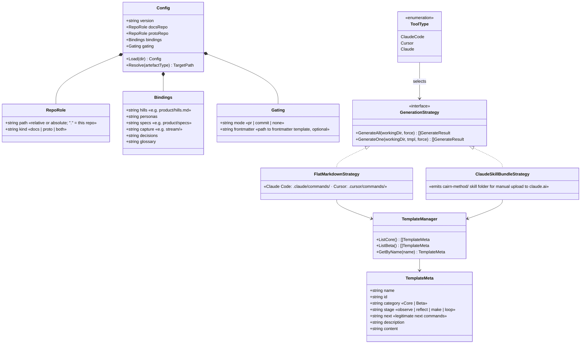
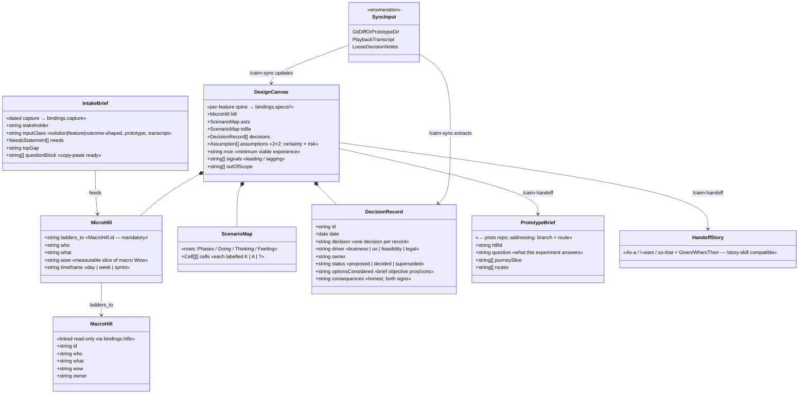

# cairn — Prompt-driven Product Design Thinking kit on the EDT Loop

## Requirements

- Build a cross-platform CLI (`cairn`) + five agent command templates that give POs, Designers and fullstack Engineers a structured, gated Product Design Thinking pipeline mapped onto the IBM EDT Loop (Observe → Reflect → Make), producing lean markdown artefacts that are reviewable, passable, and feed downstream story-writing (`/story` skill → Jira) and development (`/spdd-analysis`).
- Port the OpenSPDD architecture (MIT, keep attribution): Go binary, embedded markdown templates with YAML frontmatter, per-tool generation strategies, `init`/`generate`/`list`/`version`/`uninstall` commands, goreleaser → Homebrew tap distribution.
- Make the setup **generic via declared variables**: a committed `.cairn.yaml` binds two repo roles (`docs_repo`, `proto_repo` — may be the same repo) and per-artefact paths (`hills`, `personas`, `specs`, `capture`, `decisions`, `glossary`), every binding optional with a kit-native fallback tree. procureai-docs + version0 are only the beta binding.
- Implement the **Hill Cascade**: macro hills (≤3, project-scale, linked read-only) vs micro hills (iteration-scale, mandatory `ladders_to:`, unbounded), same Who/What/Wow grammar, macro register never written by micro-level flows.
- `/cairn-sync` closes the Loop from three input classes: git diff / prototype directory, **playback-meeting transcript** (stakeholder/client/sponsor-user), loose decision notes — emitting decision rows (driver ∈ business|ux|feasibility|legal, owner, status, hill) and canvas updates.
- Support **Claude Code, Cursor, Claude** at launch: flat-markdown command strategies for the first two, a skill-bundle emit strategy for Claude.
- **Resolved decisions**: standalone binary, not an open-spdd fork; five agent commands over three Loop stages; Hill and Canvas as separate artefacts (separate gates); hard-stop gates (command writes artefact, prints playback summary, stops); English template structure, artefact content in user's language; docs repo always canonical, prototype addressed (branch + route) and harvested; no Jira API in core (beta command later); structure-first artefacts benchmarked on `agora/spdd/prompt/*` density; the resident IBM EDT skill is the mined predecessor, not a compatibility target.
- **Boundaries**: no code generation (that is SPDD's job — handoff stops at `/spdd-analysis` input / story grammar); no portfolio-level prioritisation (assume a request exists; `cairn-discover` is a later beta command); no librarian integration; adoption is organic — no enforcement mechanics beyond the gates themselves; kit repo is `cairn` (public, akin to open-spdd).

## Entities

### CLI domain (Go)



### Method artefacts (markdown contracts)



## Approach

1. **CLI construction — port, then diverge minimally**:
   - Start from OpenSPDD's package layout (`cmd/`, `internal/{detector,templates,ui}`) with attribution in LICENSE/NOTICE; keep cobra + huh + lipgloss.
   - Add `internal/config` (the `.cairn.yaml` loader/resolver) — the one genuinely new subsystem. Resolution order per artefact type: explicit binding → kit-native fallback (`design/{intake,hill,canvas,handoff}/`).
   - Trim the detector to three tools; Claude has no repo signature — selectable only via `--tool claude` or the interactive picker.
   - Strategy registry unchanged; add `ClaudeSkillBundleStrategy` modelled on OpenSPDD's Codex skill-bundle strategy.
2. **Method templates — thin orchestrators over rich artefact grammars**:
   - Each of the five core templates defines: input contract, exploration steps, artefact grammar (sections + density rules), gate output (playback summary + who reconvenes), and `next:` guidance ("you are in {stage}; legitimate next moves: …").
   - Content mined from the IBM EDT skill (recast rule, K/A/? labels, questioning playbook, 2×2 grid) and the procureai-docs specimens (`design-thinking.md`, `hills.md`) — restated lean, not referenced live (templates must be self-sufficient once installed).
3. **Gate mechanics — artefact + stop, host-repo enforcement**:
   - Every command ends by writing its artefact and stopping; no auto-continue into the next stage.
   - `gating.mode: pr` → command instructs branch + PR (merge = playback sign-off); `commit` → direct commit allowed; `none` → file write only. Draft-first: artefacts carry `status: draft` until a playback flips them.
4. **Sync design — conservative extraction**:
   - Decision row requires an explicit commitment in the source; everything else lands as assumption/open question with a verbatim provenance quote. A miss beats noise.

## Structure

### Package layout (kit repo `cairn`)

```
cmd/cairn/main.go
cmd/{root,init,generate,list,version,uninstall}.go
internal/config/     «.cairn.yaml types, loader, path resolver — NEW»
internal/detector/   «3 tools, ported + trimmed»
internal/templates/  «manager, strategies, embed — ported»
internal/templates/data/core/     «cairn-intake|hill|canvas|handoff|sync.md»
internal/templates/data/beta/     «cairn-reverse.md, cairn-discover.md (later)»
internal/ui/         «renderer, styles — ported»
tests/               «mirrors open-spdd test layout»
.goreleaser.yaml     «brew tap block»
```

### Dependencies

1. `cmd/init` → `detector` (tool) + interactive interview → writes `.cairn.yaml` via `config`
2. `cmd/generate` → `config` (optional) + `templates.StrategyFor(tool)` → installs commands
3. Agent command templates (installed) → read `.cairn.yaml` at run time to resolve artefact paths → write artefacts → print gate summary
4. `/cairn-handoff` output → `/story` skill (story grammar) and/or `/spdd-analysis` (SPDD kit) — composition at artefact level, no binary coupling

### Command → stage → artefact map

| Command          | Stage               | Artefact → binding                               | Gate                         |
| ---------------- | ------------------- | ------------------------------------------------ | ---------------------------- |
| `/cairn-intake`  | observe             | Intake Brief → `capture` (dated, append-only)    | stakeholder answers top gap  |
| `/cairn-hill`    | reflect             | Micro hill (+ macro link) → `specs/<epic>/`      | Hill playback (Who/What/Wow) |
| `/cairn-canvas`  | reflect             | Design Canvas → `specs/<epic>/`                  | Spec playback (PR merge)     |
| `/cairn-handoff` | make                | Prototype brief + stories → `specs/<epic>/`      | build kickoff                |
| `/cairn-sync`    | loop (make→observe) | Decision rows + canvas updates → `specs/<epic>/` | iteration playback           |

## Operations

### 1. Scaffold kit repo + port OpenSPDD skeleton

1. `go mod init github.com/<owner>/cairn`; copy open-spdd `cmd/`, `internal/{detector,templates,ui}`, tests; strip SPDD template content.
2. Add NOTICE: "Portions derived from OpenSPDD (MIT, © 2026 gszhangwei)". Keep MIT.
3. Rename module symbols opnspdd→cairn; CI: `go vet`, `go test ./...`.

### 2. Implement `internal/config` (`.cairn.yaml`)

1. Types: `Config{Version, DocsRepo, ProtoRepo RepoRole, Bindings, Gating}` per Entities diagram.
2. `Load(dir)`: search CWD upward for `.cairn.yaml`; absent → zero-value config (all fallbacks).
3. `Resolve(artefactType) (path, gating)`: binding if set, else kit-native fallback under CWD; docs-repo bindings resolve relative to `DocsRepo.path`.
4. Validation: warn (not fail) on dangling paths; `cairn pathcheck` prints the resolution table.
5. Tests: table-driven — bound/unbound/cross-repo/solo-repo cases.

### 3. Trim detector to three tools

1. Keep `ClaudeCode` (`.claude`, `CLAUDE.md` signatures → `.claude/commands`), `Cursor` (`.cursor`, `.cursorrules` → `.cursor/commands`).
2. Add `Claude`: no signatures, never auto-detected; reachable via `--tool claude` / picker; output dir `cairn-skill/` in CWD.
3. Remove Antigravity/Copilot/OpenCode/Codex enum values and strategies (git history preserves them for later re-add).

### 4. Strategies

1. `FlatMarkdownStrategy` (ported): writes each core template as `<config-dir>/cairn-<name>.md`.
2. `ClaudeSkillBundleStrategy` (new, Codex-strategy pattern): emits `cairn-skill/SKILL.md` (method overview + stage router) + one reference file per command; prints manual-upload instructions; `--force` overwrites.
3. Register both in the strategy registry; default = detected tool.

### 5. `cmd/init` — interview + write config

1. Detect tool (or ask). Ask: "role of this repo?" (proto / docs / both) → `RepoRole`.
2. If proto: ask docs repo path (optional). If reachable, offer binding auto-suggestions by probing for `hills.md`-like and `personas.md`-like files (name + heading heuristic, confirm each — never bind silently).
3. Write `.cairn.yaml` with only confirmed keys; create the tool's command dir; print next steps (`cairn generate --all`).

### 6. Author the five core templates

Common frontmatter: `name, id, category: Core, stage, next, description`. Common closing block: write artefact → print playback summary (artefact path, gate owner, open questions count) → STOP → list legitimate next commands. All templates: structure-first density, K/A/? labels, `[TBD — needs X]` over fabrication, recast rule enforced.

1. **`cairn-intake.md`** (observe): classify input (solution/feature/outcome-shaped, prototype path, transcript, raw paragraph); deconstruct artefact into needs statements (recast rule); surface Who/What/Why/Wow gaps; emit Intake Brief (≤1 page) + copy-paste question block; top-gap-first.
2. **`cairn-hill.md`** (reflect): read macro hills via `bindings.hills` (read-only); draft problem statement, needs statements, **micro hill** with `ladders_to:`; refuse to finish without a macro link — "no macro hill fits" is a documented finding, not a silent skip; as-is/to-be scenario maps (4-row, K/A/? cells); assumptions 2×2.
3. **`cairn-canvas.md`** (reflect): assemble Design Canvas per artefact grammar (hill echo, journey mermaid, decision table, MVE, signals, out-of-scope); every decision row satisfies the five record-quality criteria; sections capped — new content replaces, never appends sprawl.
4. **`cairn-handoff.md`** (make): emit Prototype Brief (hill id, question the experiment answers, journey slice, branch + route addressing) and/or story set (As-a/I-want/so-that + Given/When/Then, `/story`-skill compatible) and/or `/spdd-analysis` input block.
5. **`cairn-sync.md`** (loop): accept diff/prototype-dir | transcript | loose notes; extract decisions conservatively (explicit commitment only, verbatim provenance quote, driver + owner mandatory); update canvas cells A→K where evidence lands; flag journey divergence prototype-vs-canvas; output = canvas PR per `gating.mode`.

### 7. Beta template

1. **`cairn-reverse.md`** (beta): read an existing prototype (sitemap/routes/components) → draft canvas + micro hill with every journey cell labelled A; explicit banner "reverse-engineered — validate at next playback".

### 8. Distribution

1. `.goreleaser.yaml`: darwin/linux/windows builds, brew tap block (`<owner>/homebrew-tools`, formula `cairn`).
2. `scripts/install.sh` (go install path) ported; `uninstall` ported (classifies brew vs go install; leaves generated templates + `.cairn.yaml` untouched).

### 9. Beta binding validation

1. Run `cairn init` in version0 → proto role, docs repo = procureai-docs, bindings confirmed to `product/hills.md`, `product/personas.md`, `product/specs`, `stream/`.
2. Golden-file test: `Resolve()` table for the beta binding; smoke: `/cairn-hill` template renders macro hills from the real hills.md structure (fixture copy).
3. Dry-run one real iteration (next Hill-2 slice) end-to-end; capture friction as issues.

## Norms

1. **Go**: match open-spdd idioms — table-driven tests in `tests/` mirroring package layout; errors via `internal/errors.go` patterns; no new deps beyond ported ones + `gopkg.in/yaml.v3`.
2. **Template frontmatter**: `name` (slash form), `id`, `category`, `stage`, `next`, `description` — parsed by the ported `ParseFrontmatter`, extended for `stage`/`next`.
3. **Artefact grammar norms** (embedded in every template):
   - Structure-first: mermaid (journey/sequence/state/class), tables, lists; prose only for rationale. drawio permitted where mermaid runs out; mermaid preferred (native GitLab/GitHub rendering).
   - Five record-quality criteria verbatim in each template's Norms block: minimal scope; one decision per record; decision + rationale core with brief objective option trade-offs; honest consequences both signs, no defensive language; timeless + self-sufficient (no links to gitignored files or living docs).
   - Evidence labels: K/A/? on scenario cells; `[TBD — needs X]` elsewhere; never fabricate.
   - Language: English section structure and keys; content in the user's working language; EDT terms as English proper nouns (Hill, Playback, Sponsor User).
4. **Naming**: installed commands `cairn-<verb>`; artefact files under bound paths follow the host repo's convention; kit-native fallback uses `{TICKET}-{YYYYMMDDHHmm}-[Stage]-{kebab-slug}.md`.
5. **Host-repo respect**: when `gating.frontmatter` is set, prepend the host's frontmatter template to every truth artefact; relative links only; never edit files outside resolved bindings.

## Safeguards

1. **Macro register is read-only from micro flows.** No command may modify the file bound to `hills` except an explicit, human-confirmed promotion flow (not in v1). Violation = template bug.
2. **No code generation.** `/cairn-handoff` stops at briefs/stories/analysis-input. Prototype building and SPDD stages are downstream consumers.
3. **Conservative sync.** A decision row requires an explicit commitment quote from the source. Ambiguity → assumption or open question. Never merge sync output silently when `gating.mode: pr`.
4. **One home per artefact type.** If a binding exists, the kit never creates the kit-native fallback for that type. Fallback tree only for unbound types.
5. **Gates are hard stops.** Commands end after artefact + summary; continuing requires a new invocation. No template may chain into the next stage automatically.
6. **Size budgets**: Intake Brief ≤ ~120 lines; canvas ≤ ~400 lines (agora benchmark ceiling); command template ≤ open-spdd's per-command size. Exceeding budget = restructure, not append.
7. **Licence/attribution**: MIT with OpenSPDD attribution preserved; IBM EDT referenced as inspiration ("based on concepts from IBM Enterprise Design Thinking"), no implied endorsement, no IBM marks in the kit name.
8. **Never bind silently**: `init` confirms every auto-suggested path with the human; a wrong hills binding corrupts the cascade.
9. **Beta repos' constitutions untouched**: the kit adapts to procureai-docs' AGENTS.md/frontmatter; it never edits AGENTS.md, `_templates/`, or `stream/` content.
10. **Name is a single constant**: binary name, command prefix, and config filename derive from one build-time constant + template token, so the working name `cairn` can be swapped before first release with a one-line change + template render.
